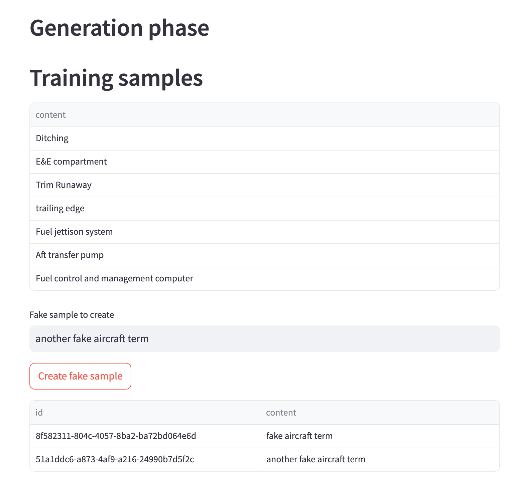
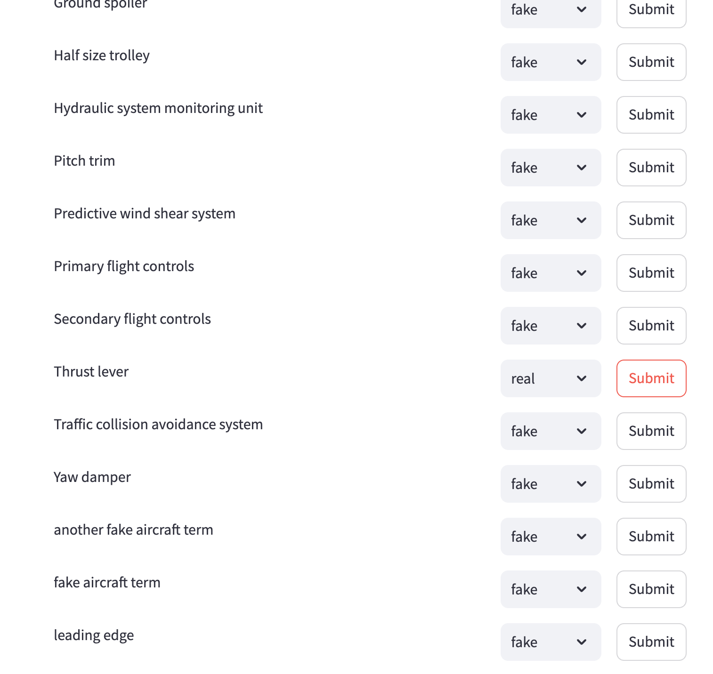

# Human GAN

Human GAN is a collaborative group game where groups of up to 10 people work together as parts of a generative adversarial network. The goal is to have fun while getting a feeling for the dynamics of a GAN.

## How to play

Human GAN is played in two phases: the generation phase and the discrimination phase.

### Generation phase

Each group is shown the same dataset. A dataset is a set of samples from any probability distribution of texts. For example, a dataset could be a set of car parts, authors from a specific genre, or a set of words from a specific language. However, the groups only get shown a small random subset of the dataset, typically around 5-10 samples. The groups now have to generate an agreed-upon number of new, fake samples that look like they could have come from the same distribution as the dataset. Around 5 samples is a good number to start with.

### Discrimination phase

Now, each group gets real samples mixed with the fake samples generated by the other groups. The groups have to guess which samples are real and which are fake. The groups get points for guessing correctly, and lose points for their fake samples being exposed as fake.

## How to organize a game

As an organizer, you can follow the following steps to play a human GAN game:

1. Open https://human-gan.streamlit.app/ in a browser. The software from this repository is deployed there.
2. Select a name for a new game and click "Create game". If you want to return to the game later, note down the url or the game password.
3. Create the teams. Share with each team the respective team password. The teams can now join the game by entering the password on the home page.
4. Insert the dataset. This can be any text file, on sample per line. For an example, see this [example](datasets/airplanes.txt).
5. In the game phase dropdown, select "Generation" and click "Change phase". The teams can now generate their samples once they have joined the page and reload the page.
6. Wait till all teams have generated the agreed-upon number of samples. Then, in the game phase dropdown, select "Discrimination" and click "Change phase".
7. The teams can now guess which samples are real and which are fake. After all teams have guessed, the game is over. Select the "done" phase in the dropdown and click "Change phase" to let the teams know how many points they got.